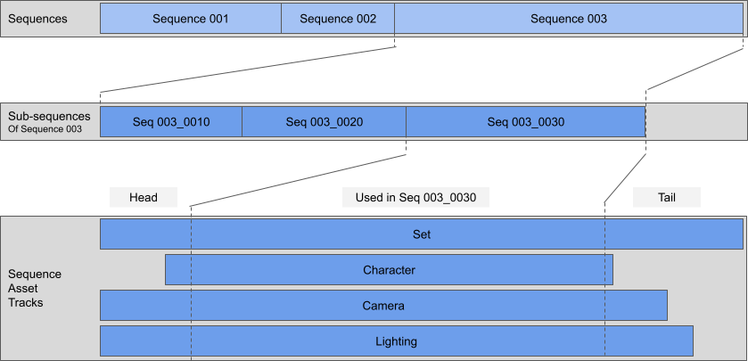

# Concepts and terminology

This section describes the main elements involved in a cinematic as they appear
in the Sequences features, and explains their mutual relationships.

## Editorial

The Editorial represents all the content of a cinematic, as it is structurally and chronologically organized in Unity.

The Sequences package allows you to manage two types of complementary elements that help you iterate faster in your editorial tasks:

* [Sequences](#sequences), which act as **structural containers** of your Editorial.

* [Sequence Assets and Variants](#sequence-assets), which represent the actual **creative content** that you can use to populate the Sequences.

## Sequences

Sequences are structural containers that help you organize and manage your cinematic Editorial in a modular way.

### Editorial structure

You can structure your Editorial with a depth of up to 3 levels of Sequences:

The Master Sequence represents the top level of your cinematic. You can create more than one Master Sequence within the same Unity project.

The Master Sequence can contain several Sequences, which can also contain several Sequences. All of them work the same way and benefit from the same functionality, according to their hierarchical position.

You could use this 3-level structure the following way, for example:
* The Master Sequence could represent a film, a piece of a film, a series episode, a game cinematic, an archviz, or a design cinematic.
* The second level of Sequences could represent a different unit of time and place according to the story you are telling.
* The third level of Sequences could represent a section of animation from one cut to the next cut.

### Initial structure content

When you create a Sequence, Unity automatically creates, configures, and links all the necessary GameObjects and assets that allow you to easily control all levels of your Editorial structure.

From a creative point of view, Sequences are placeholders ready to be populated.

### Populating your Editorial

You can populate Sequences at any level of your Editorial structure, either by adding creative content that you might already have, or by creating new content as you go.

The Sequences package includes features that help you manage your creative content elements in an organized and modular way, through the use of categorized, self-contained, and easily swappable [Sequence Assets](#sequence-assets).

**Note:** You can use the basic features of the Unity Editor to populate your Sequences with your own assets if you need to keep a full control over your content sources and the way to manage them. However in that case, you cannot benefit from the Sequence Asset categorization and in-context management features of the Sequences package.

## Sequence Assets

A Sequence Asset represents the creative unit of a Sequence. This can be, for example, a character, a camera, an FX, a lighting set...

A Sequence Asset can consist of static or animated elements, or both. Animated elements can be:
* Baked – for example: keyframed animation of a character
* Real-time – for example: procedurally animated character
* Live – for example: a virtual camera or motion capture
* Recorded – for example: a virtual camera record

Sequence Assets are [Prefabs](https://docs.unity3d.com/Manual/Prefabs.html) that benefit from a specific [configuration and structure](under-the-hood.md#sequence-assets-and-variants) that make them ready to use in your Sequences.

You can create [Sequence Asset Variants](#sequence-asset-variants) to safely explore variations of your Sequence Assets and easily swap them in context to allow you to choose the one that best suits your needs.

All Sequence Assets and their Variants are organized in [Asset Collections](#asset-collections) to help you better identify them and keep them organized while you work on your cinematic.

### Asset Collections

By default, there are 7 types of Asset Collections:

| **Asset Collection type** | **Typical use** |
|----------------------|-----------------|
| Character | For animated characters (actors). |
| Fx | For special effects (smoke, fire, physics simulation…) |
| Lighting | For lighting sets. |
| Photography | For cameras and compositing layers. |
| Prop | For various accessories. |
| Set | For environments and backgrounds. |
| Audio | For music, voice or any other sound effects. |

A Sequence Asset is necessarily part of an Asset Collection. This defines the way Unity regroups all your Sequence Assets in the Editor interface and stores their data in your project folders.

### Sequence Asset Variants

Sequence Asset Variants are [Prefab Variants](https://docs.unity3d.com/Manual/PrefabVariants.html). In summary, this means the following:

* When you create a Variant from a Sequence Asset, it dynamically inherits from all properties that you might change in the base Sequence Asset.

* You can apply local overrides on specific properties of the Variant without affecting the base Sequence Asset.

* If needed, you can backport overrides from a Variant to its base Sequence Asset. This automatically spreads specific changes across all Variants of this base Sequence Asset, unless the other Variants have a local override on the involved properties.

**Note:** The Sequences package allows you to duplicate Variants based on the same Sequence Asset, but does not allow you to create Variants of Variants.

## Editorial cuts

You can trim any Sequence within your Editorial structure to only get the portions of the contained Sequences or Sequence Asset tracks that you need in your cinematic. You can also reorder them.

 *Conceptual example of Sequence Asset tracks cut throughout the Editorial structure.*
