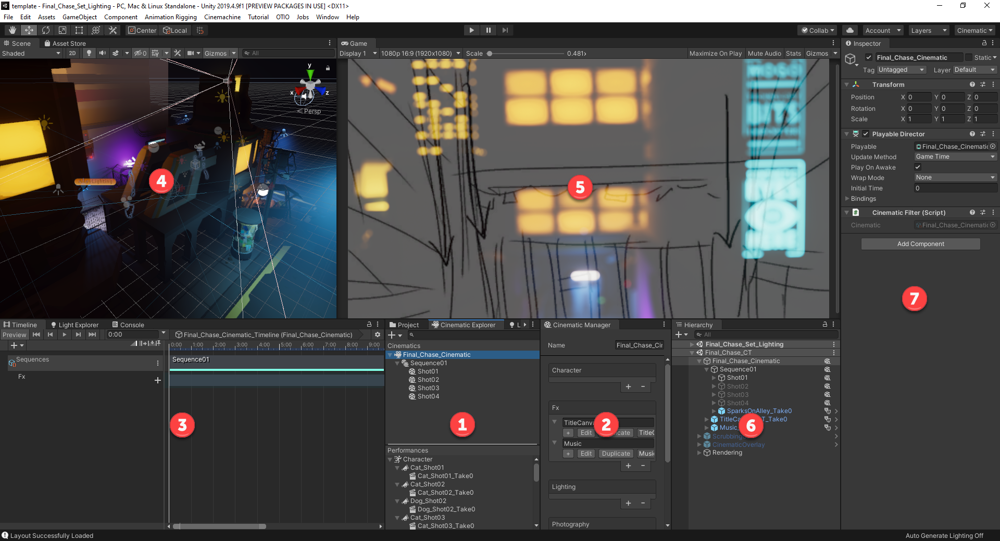

# Features & integrations

The Sequences package includes cinematics-dedicated features and integrates with other features of the Unity Editor. The following table lists the Unity Editor windows that you can use to perform specific tasks through these features.

| **Window** | **Tasks** |
|------------|--------------|
| [Sequences window](sequences-window.md) | • Create, organize and browse through the Sequences you’re working on. • Create and edit Sequence Assets and Variants to further use them in your Sequences. • Load Scenes used in the context of specific Sequences. • Record and export videos or other specific data from your Sequences. |
| [Sequence Assembly window](sequence-assembly-window.md) | • Populate your Sequences with Sequence Assets. • Swap and manage Sequence Asset Variants in context. |
| [Timeline window](timeline-window.md) | • Navigate through your Sequences and preview your assembled content in context. • Edit, trim and reorder your Sequences. • Manage the activation of Scenes used in specific Sequences. |
| [Hierarchy window](hierarchy-window.md) | • Create and structure Sequences directly through GameObjects. • Populate your Sequences with Sequence Assets directly under the Sequence GameObjects. |

**Note:** Under the hood, the Sequences package features automatically create, organize
and adjust:
-   All underlying Unity elements necessary to support the overall Sequences functionality in the Unity Editor.
-   All necessary assets under a convenient folder structure.
-   All Timelines and nested Timeline tracks that allow you to edit your cinematic content.

## Main achievable tasks

The following table lists the main high-level tasks that you can achieve with the Sequences package and the dedicated features you should preferably use to safely perform these tasks.

| **Task** | **Recommended features** |
|----------|--------------------------|
| Create Sequences and structure the Editorial | • Sequences window (Structure section) |
| Create Sequence Assets and Variants | • Sequences window (Asset Collections section), or • Sequence Assembly window (Variants only, in context) |
| Edit Sequence Assets and Variants | • Sequences window (Asset Collections section) |
| Populate Sequences with Sequence Assets | • Sequence Assembly window |
| Swap Sequence Asset Variants | • Sequence Assembly window |
| Preview, trim and reorder Sequences | • Timeline window |
| Manage Scene activations | • Timeline window |
| Load Scenes used by Sequences | • Sequences window (Structure section) |
| Record and export Sequences | • Sequences window (Structure section) |

## Recommended Editor layout

To take full advantage of the Sequences package features, you might need to have the following windows open in the Editor:

1.  Sequences window
2.  Sequence Assembly window
3.  Timeline window
4.  Scene view
5.  Game view
6.  Hierarchy window
7.  Inspector

