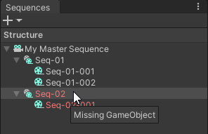

# Hierarchy window

The Sequences package includes additional features that help you manage your Sequences from the Hierarchy window. The use of these features ensures a full compatibility with the Sequences package overall functionality.

**Note:** This page provides straightforward instructions to guide you through the specific use of the Sequences features available from the Hierarchy window. For general information on the Hierarchy window and GameObjects management, see the [Unity Manual](https://docs.unity3d.com/Manual/index.html).

## Creating Sequences

Depending on the Sequence level you are starting from:

* To create a Master Sequence, right-click in your current Scene and select **Sequences > Master Sequence**.

* To create a Sequence, right-click on the GameObject that represents the Sequence (or Master Sequence) that should contain the one you want to create, and select **Sequences > Sequence**.

## Deleting Sequence GameObjects  (not recommended)

The Unity Editor does not prevent you from deleting GameObjects that represent Sequences in the Hierarchy window.

However, as these GameObjects use specific functional assets (Timelines and script) that make them compatible with the Sequences package features, you should preferably [delete your Sequences through the Sequences window](sequences-window.md#deleting-sequences) to prevent them from becoming invalid.

 _Example: Sequence and Sequence child that became invalid in the Sequences window after deletion of their GameObjects from the Hierarchy._

### Troubleshooting
* If you just deleted a Sequence GameObject by mistake, immediately use the undo action of the Unity Editor to properly restore the Sequence.
* Otherwise, delete the invalid Sequence from the Sequences window to complete the deletion.
