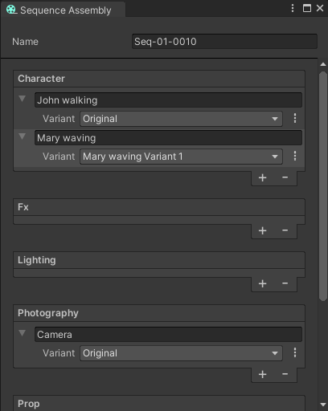
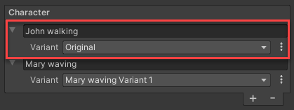
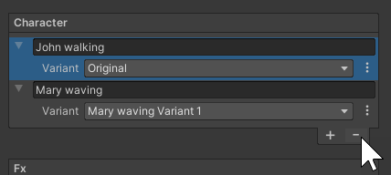

# Sequence Assembly window

The Sequence Assembly window allows you to populate your Sequences with Sequence Assets and swap Sequence Asset Variants. From this window, you can also create and manage Sequence Assets and Variants in context.

To open the Sequence Assembly window, from the main menu of the Editor, select **Window > Sequencing > Sequence Assembly**.

## Properties

The Sequence Assembly window acts as a simplified Inspector which displays the properties of the Sequence currently selected in the [Sequences window](sequences-window.md), and allows you manage the Sequence Assets you want it to contain.

| **Property** | **Description** |
|--------------|-----------------|
| **Name** | The name of the Sequence currently selected in the [Structure section](sequences-window.md#the-structure-section) of the Sequences window.  **Note:** If you want to rename the Sequence, use the Sequences window. |
| **Character**, **Fx**, **Lighting**, **Photography**, **Prop**, **Set**, **Audio** | These sections correspond to the Asset Collection types available in the [Asset Collections section](sequences-window.md#the-asset-collections-section) of the Sequences window.  Through each section, you can add and edit Sequence Assets of the corresponding Asset Collection type for the selected Sequence. |

## Adding a Sequence Asset

Use this method to add Sequence Assets that you previously created in your Asset Collections.

Select the **+** (plus) button at the bottom of the desired Asset Collection type section, then select the desired Sequence Asset in the list.

## Creating a new Sequence Asset in context

Select the **+** (plus) button at the bottom of the desired Asset Collection type section, then select **Create Sequence Asset**.

This action creates the Sequence Asset under the corresponding Asset Collection type and directly adds it to the selected Sequence.

## Managing Sequence Asset Variants

Once you added a Sequence Asset to a Sequence, the Sequence Assembly window allows you to select a specific Variant to use. It also allows you to create, duplicate or delete Variants in context.

| **Property** || **Description** |
|:---|:---|:---|
| Name field || The name of the Sequence Asset.  You can rename the Sequence Asset through this field. The new name is applied everywhere the Sequence Asset appears in the Editor. |
| **Variant** || Use this list to select the Sequence Asset Variant that you want to use in the selected Sequence, if the Sequence Asset has Variants.  By default, the Sequence Assembly window sets this property to "Original", which corresponds to the base Sequence Asset. |
| Options button ( **⋮** ) || Allows you to create, duplicate, and delete Sequence Asset Variants in context. |
|| Create new variant | Creates a new Variant from the current Sequence Asset.  If you want to use this Variant in the current Sequence, you must still select it in the **Variant** list. |
|| Duplicate current variant | Creates a duplicate of the currently selected Variant.  If you want to use this Variant in the current Sequence, you must still select it in the **Variant** list. |
|| Delete current variant | Permanently deletes the currently selected Variant from your Unity project.  Once the Variant is deleted, the selection in the **Variant** list automatically falls back to the original Sequence Asset. |

### Removing a Sequence Asset

To remove a Sequence Asset from the current Sequence, select the area at the left of the Sequence Asset name, and then select the **-** (minus) button at the bottom of the Asset Collection type section.

**Note:** This action only removes the Sequence Asset from the current Sequence. It does not delete it from your Asset Collections.
