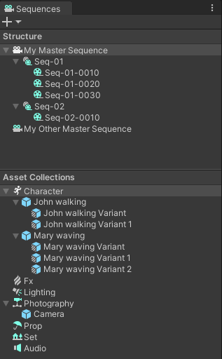
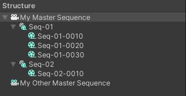
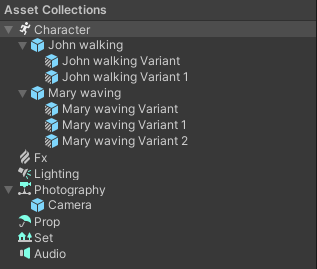

# Sequences window

The Sequences window allows you to:
* Create, organize and browse through the [Editorial structure](concepts.md#editorial) of the Sequences you’re working on.
* Create and manage [Sequence Assets and Variants](concepts.md#sequence-assets) that you can use in your Sequences.

To open the Sequences window, from the main menu of the Editor, select **Window > Sequencing > Sequences**.

The Sequences window consists of two separate sections:

* The [Structure section](#the-structure-section) contains a straightforward hierarchy of the Sequences you’re working on.

* The [Asset Collections section](#the-asset-collections-section) contains a categorized list of all available Sequence Assets and Variants that you can use in your Sequences.

## The Structure section

The Structure section mainly allows you to:

* [Set up the overall structure](#creating-sequences) of your cinematics.

* [Browse through all Sequences](#browsing-through-sequences) that compose your cinematics.

Additionally, from this section:

* You can manage the [activation of additional Scenes](#setting-up-scene-activation-in-a-sequence) in the context of specific Sequences.

* if you installed the Unity Recorder, you can quickly [record any Sequence](#recording-sequences) and export it, for example, to a video file.

>**Note:** the Sequences package also includes features that allow you to manage your Sequences structure directly from the [Hierarchy window](hierarchy-window.md).

### Creating Sequences

Depending on the Sequence level you are starting from:

* To create a Master Sequence, select the **+** (plus) button at the top left of the Sequences window, then select **Create Master Sequence**.

* To create a Sequence within another Sequence, right-click on the Sequence (or Master Sequence) that should contain the one you want to create, and select **Create Sequence**.

When the new Sequence appears in the Structure, you can directly rename it and press the Enter key or click anywhere to complete the creation.

Once you have created a new Sequence, you can use the [Sequence Assembly window](sequence-assembly-window.md) to populate it with Sequence Assets or Variants from your [Asset Collections](#the-asset-collections-section).

### Renaming Sequences

To rename a Sequence, select it twice, then type the new name and press the Enter key or click anywhere to confirm the renaming.

### Deleting Sequences

To delete a Sequence from your project, select it and press the Delete key or right-click on it and select **Delete**. This also automatically deletes from your project all Sequences the deleted Sequence may contain.

### Browsing through Sequences

When you select a Sequence in the Structure section:

* The [Sequence Assembly window](sequence-assembly-window.md) displays the properties of the selected Sequence. This is where you can add Sequence Assets to the selected Sequence.

* The [Timeline window](timeline-window.md) displays the tracks contained in the selected Sequence. This is where you can trim and reorder the clips within the selected Sequence.

### Setting up Scene activation in a Sequence

To create a new Scene and have it activated during the time of a specific Sequence:

1. In the Structure Section, right-click on the Sequence, and select Create Scene.
2. Select the location to store the Scene file and specify a name for it.

This action creates an empty Scene that you can further edit. It also creates a Scene Activation track in the selected Sequence in Timeline, and binds the new Scene to this track. Finally, it also additively loads the new Scene in the Hierarchy.

>**Note:** If you want to bind an existing Scene to the track instead of creating a new Scene, you need to create the Scene Activation track from the [Timeline window](timeline-window.md#scene-activation-track).

You can add Scene Activation tracks at any level of your Sequence structure, and you can use as many Scene activation tracks as you need in a single Sequence.

>**Important:** To see a Scene in your Scene and Game views when Unity activates it through a Scene Activation track, you must previously load it in addition to the Scene that contains your Sequences structure. Depending on your current task, you can:
>* [Load Scenes contextually](#loading-scenes-contextually) in Edit mode for any Sequence, directly from the Sequences window.
>* [Set up a Scene Loading Policy](#setting-up-a-scene-loading-policy) to automatically load Scenes in runtime.

### Loading Scenes contextually

If you have set up Scene Activation tracks in your Sequences structure, you can load any of the corresponding Scenes directly from the Structure section, according to the context of the Sequence you are working on, in Edit mode.

To do this, right-click on the targeted Sequence and select one of the following actions:

| **Action** | **Description** |
|------------|-----------------|
| **Load Scenes** | Additively loads all the Scenes that are bound with a Scene Activation track at any level of the Sequences structure within the time range of the selected Sequence. |
| **Load specific Scene** | Allows you to additively load any specific Scene among the ones that are bound with a Scene Activation track at any level of the Sequences structure within the time range of the selected Sequence. |

### Setting up a Scene Loading Policy

If you have set up Scene Activation tracks in your Sequences structure, you might want Unity to automatically load the corresponding Scenes when you enter the Play mode or when you run a Player build of your project, to ensure that the result includes all of them whatever their current status in Edit mode.

To do this:
1. In the Sequences window, select the Master Sequence.
2. In the Inspector, in the **Sequence Filter** component, click on **Add Scene Loading Policy**.
3. Set up the [Scene Loading Policy](ref-components.md#scene-loading-policy) component according to your needs.

### Recording Sequences

You can use the Recorder to export the rendered video, an animation, or a specific render pass from a Sequence, directly from the Structure section.

>**Note:** This feature is available only if you installed the [Unity Recorder](https://docs.unity3d.com/Packages/com.unity.recorder@latest/index.html), and possibly other add-ons, depending on the type of data you need to export.

In the Structure section, right-click on the targeted Sequence and select one of the following actions in the contextual menu:

| **Action** | **Description** |
|------------|-----------------|
| **Record As...** | Opens the Recorder window and automatically sets the Start and End frames to the values that currently delimit the Sequence that you want to record. Once the Recorder window opens, [add and configure Recorders](https://docs.unity3d.com/Packages/com.unity.recorder@latest/index.html) according to the outputs you want to get, and manually start the recording. |
| **Record** | Opens the Recorder window and automatically starts the recording with the last used Recorder list and settings. |

>**Note:** The feature automatically adjusts the output path of the recording according to the Sequence you selected to record.

## The Asset Collections section

The Asset Collections section allows you to create and organize Sequence Assets and Variants, which represent the actual creative content that you can use in your Sequences.

### Creating a Sequence Asset

To create a new Sequence Asset:

1.  In the Asset Collections section, right-click on an [Asset Collection type](concepts.md#asset-collections) and select **Create Sequence Asset**.
     - OR -
     Select the **+** (plus) button at the top left of the Sequences window, then select **New Sequence Asset** and select the Asset Collection type you want to create the Sequence Asset in.

2.  Rename the new Sequence Asset as you wish and press the Enter key or click anywhere to complete the creation.

### Creating a Variant from a Sequence Asset

To create a new Variant from an existing Sequence Asset, right-click on the Sequence Asset and select **Create Variant**.

This action automatically names the Variant after the Sequence Asset name, suffixed with `Variant`, and with an incremental ID number if the name already exists.

### Duplicating a Sequence Asset Variant

To duplicate a Sequence Asset Variant, right-click on it and select **Duplicate**.

This action automatically names the duplicate Variant after the name of the source Variant, suffixed with an incremental ID number.

>**Note:** After the duplication, the two Variants have the exact same content but are independent Variants of the same Sequence Asset.

### Editing a Sequence Asset or Variant

To edit a Sequence Asset or a Sequence Asset Variant, double-click on it in the Asset Collections section.

This opens the corresponding Prefab or Prefab Variant in isolation in the Scene view so that you can edit its content.

>**Note:** You can also open your Sequence Assets and Variants directly from the Project window, or from the Hierarchy. In all cases, see the Unity Manual for more details on how to [edit Prefabs](https://docs.unity3d.com/2020.1/Documentation/Manual/EditingInPrefabMode.html) and manage overrides in [Prefab Variants](https://docs.unity3d.com/Manual/PrefabVariants.html).

### Renaming a Sequence Asset or Variant

To rename a Sequence Asset or a Sequence Asset Variant, select it twice, then type the new name and press the Enter key or click anywhere to confirm the renaming.

When you rename a Sequence Asset, this also renames its Variants if they were still named after it.

>**Note:** You can fully rename Variants independently from the original Sequence Asset without affecting their functional relationship.

### Deleting a Sequence Asset or Variant

To delete a Sequence Asset or a Sequence Asset Variant, select it and press the Delete key or right-click on it and select **Delete**.

>**Attention:**
>* When you delete a Sequence Asset, this also deletes all its Sequence Assets Variants if it has any.
>* You cannot undo the deletion of Sequence Assets and Sequence Asset Variants.
