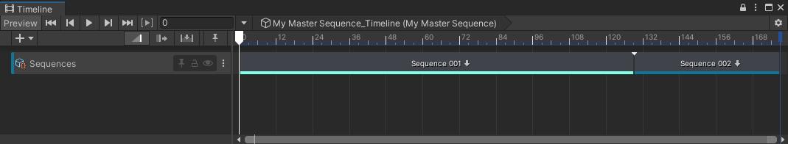
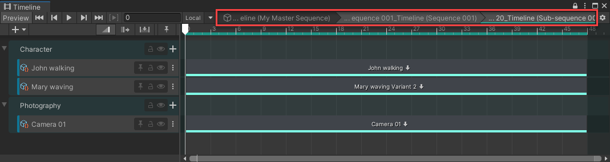
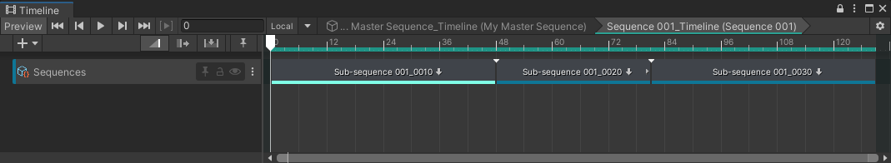
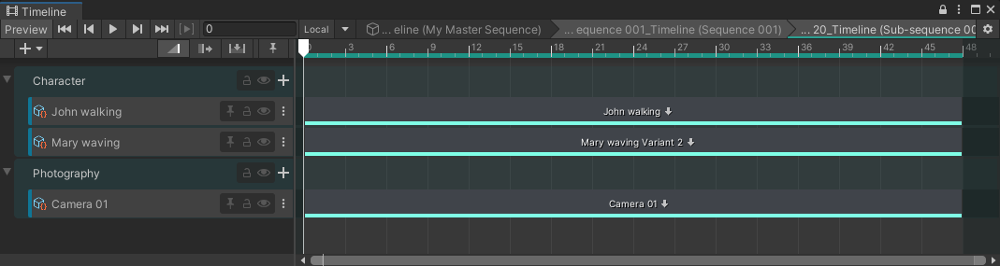
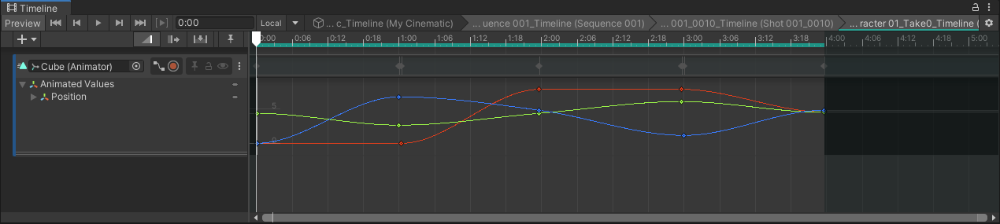
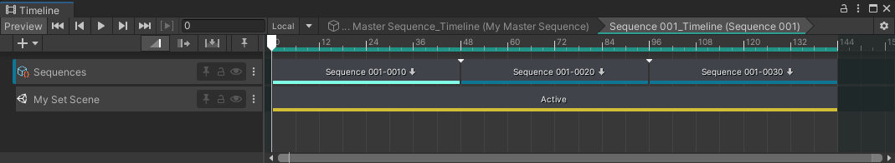
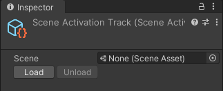
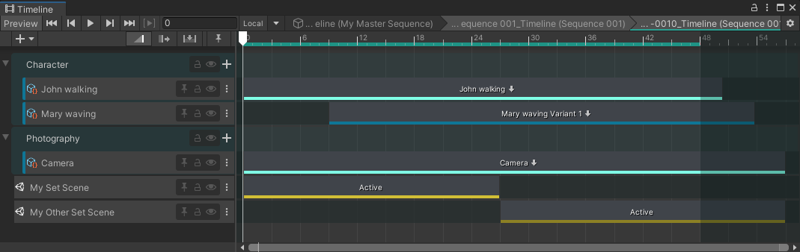

# Timeline window

In the context of the Sequences package, the Timeline window allows you to edit, reorder and trim all Sequences and clips of your cinematic, and play them back for preview purposes.

To open the Timeline window, from the main menu of the Editor, select **Window > Sequencing > Timeline**.

**Note:** This page only provides straightforward instructions to guide you through the specific use of the Sequences features available from the [Timeline](https://docs.unity3d.com/Packages/com.unity.timeline@latest) window.

## Navigation

When you navigate through your Sequences from the Structure section of the Sequences window or from the Hierarchy window, the Timeline window displays the Timeline of the current selected Sequence.

You can also navigate through your Sequences from the Timeline window:

* Double click on any clip that represents an element of your Editorial structure to access its Timeline (at the lower level of the structure).

* The breadcrumb trail at the top of the Timeline window allows you to access any parent Timeline of the currently displayed one.

## Timeline track types

### Editorial track

When a Sequence contains other Sequences, its Timeline includes an **Editorial** track with clips that represent the Sequences it contains.

 *Example: In a Master Sequence timeline, the Editorial track (here, named "Sequences") with two Sequence clips.*

You can double-click on a Sequence clip to access the Timeline of this Sequence at the immediate sub-level of the structure.

 *Example: In a Sequence timeline of 2nd level, the Editorial track (here, named "Sequences") with three Sequence clips.*

The Sequences package automatically creates and configures Editorial tracks when you create Sequences through the Sequences window or through the Hierarchy.

> **Note:** You can manually create an Editorial track through the Timeline Add Track menu: select the **+** (plus) button or right-click in an empty area of the track list, and then select **Sequencing > Editorial Track**. However, such a track would require some more advanced configuration to become usable in the context of Sequences.

### Sequence Asset track

When a Sequence contains Sequence Assets, its Timeline includes one track per Sequence Asset, all regrouped by Asset Collection type.

Each Sequence Asset track includes a unique clip that represents the Sequence Asset or Variant that you are currently using in your cinematic.

 *Example: Timeline of a Shot with three Sequence Asset tracks in their corresponding Asset Collection track groups: two characters and one camera.*

You can double-click on each clip to directly access the Timeline of the corresponding Sequence Asset or Variant, and edit it.

 *Example: Timeline of a Sequence Asset with a simple animation clip.*

The Sequences package automatically creates and configures Sequence Asset tracks when you add Sequence Assets to a Sequence through the Sequence Assembly window or through the Hierarchy.

> **Note:** You can manually create a Sequence Asset track through the Timeline Add Track menu: select the **+** (plus) button or right-click in an empty area of the track list, and then select **Sequencing > Sequence Asset Track**. However, such a track would require some more advanced configuration to become usable in the context of Sequences.

### Scene Activation track

When a Sequence uses a Scene that needs to be activated in its specific context, the Timeline of this Sequence includes a Scene Activation track.

 *Example: Timeline of a Sequence with one Scene Activation track.*

>**Important:** To actually see a Scene in your Scene and Game views when Unity activates it through a Scene Activation track, you must ensure to have previously additively loaded it along with the Scene that contains your Sequences structure. For convenience, the Sequences package allows you to [load Scenes in context](sequences-window.md#loading-scenes-contextually).

The Sequences package automatically creates and configures Scene Activation tracks when you create a Scene for a Sequence through the Sequences window.

You can also manually create and configure a Sequence Asset track through the Timeline Add Track menu:

1. Select the **+** (plus) button or right-click in an empty area of the track list, and then select **Scene Activation Track**.

2. Select the created track in the track list.

3. In the Inspector, use the **Scene** field to target an existing Scene.

   

4. Select **Load** if you need to load the targeted Scene in the Hierarchy, in addition to the Scene that contains your Sequences.

## Moving and trimming clips

You can move and trim any Sequence, Sequence Asset and Scene Activation clips within the Timeline track that contains them, to rearrange the action within your cinematic and adjust your cuts.

 *Example: Timeline of a Shot with trimmed clips in Sequence Asset and Scene Activation tracks. Notice the highlighted area that represents the actual length of the Sequence that contains these tracks.*
