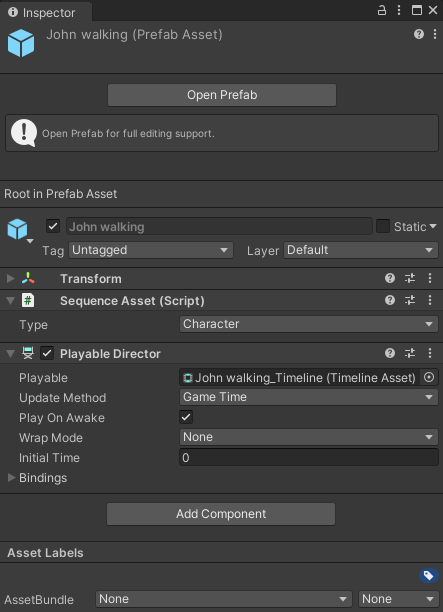
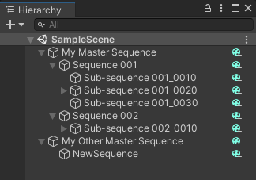
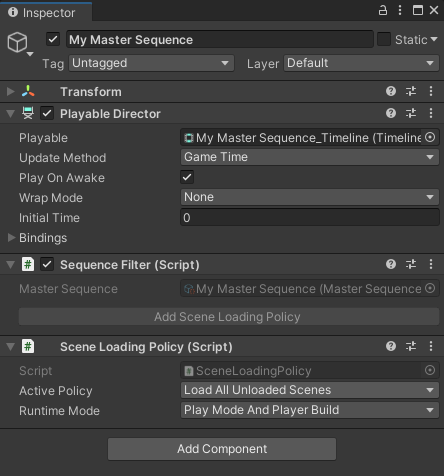
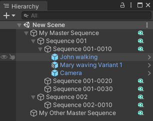
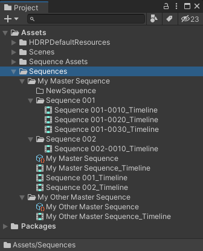
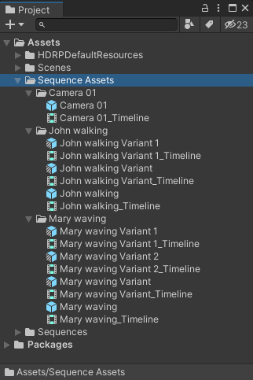

# Under the hood

The Sequences features automatically create, configure and update for you all the asset files and folders as well as the GameObjects and hierarchy to help you keep your focus on your cinematic creation.

## Sequences package underlying processes

This section describes the underlying processes Unity automatically goes through when you use the Sequences features.

### Master Sequence creation

When you create a Master Sequence from the Structure section of the Sequences window:

-   In the Project, this creates a script asset *and* a Timeline asset:
    -   Named both after the Master Sequence
    -   Within a folder named after the Master Sequence (under the `Assets/Sequences` folder)

-   In the Hierarchy, this creates a GameObject:
    -   Named after the Master Sequence
    -   With a Playable Director component bound to the Timeline asset of the Master Sequence
    -   With a Sequence Filter component bound to the script asset of the Master Sequence

### Sequence creation in another Sequence

When you create a Sequence in another Sequence (here called "parent Sequence", which can be a Master Sequence) from the Structure section of the Sequences window:

-   In the Project, this creates a Timeline asset:
    -   Named after the new Sequence
    -   Within the folder that stores the parent Sequence

-   In the Hierarchy, this creates a GameObject:
    -   Named after the new Sequence
    -   As a child of the GameObject corresponding to the parent Sequence
    -   With a Playable Director component linking to the Timeline asset of the new Sequence
    -   With a Sequence Filter component linking to the script asset of the Master Sequence

-   In the Timeline of the parent Sequence, this creates a clip:
    -   Within a "Sequences" track
    -   Bound to the created Timeline asset of the new Sequence, as a nested Timeline

### Sequence Asset creation

When you create a Sequence Asset under a specific Asset Collection type in the Sequences window:

-   In the Project, this creates a Prefab *and* a Timeline asset:
    -   Both named after the Sequence Asset
    -   Within a folder named after the Sequence Asset (under the `Assets/Sequence Assets` folder)

### Variant creation/duplication

When you *add* a Variant from a Sequence Asset:

-   In the Project, this creates a Prefab Variant from the base Prefab *and* a Timeline asset:
    -   Both named after the Sequence Asset Variant
    -   Within the folder that stores the Sequence Asset

When you *duplicate* a Variant, all happens the same, except that the content of the new Prefab Variant is an exact copy of the Prefab Variant you duplicated.

### Sequence population

When you populate a Sequence with a Sequence Asset from the Sequence Assembly window, this instantiates the Sequence Asset Prefab under the Sequence GameObject in the Hierarchy.

### Sequence Asset Variant swapping

When you swap Sequence Asset Variants in a Sequence from the Sequence Assembly window, this swaps the corresponding instances of Sequence Asset Prefab Variants under the Sequence GameObject in the Hierarchy.

## Sequence Assets and Variants

Sequence Assets are [Prefabs](https://docs.unity3d.com/Manual/Prefabs.html). This helps you keep all your creative assets self-contained and prevents you from experiencing any binding issues across your assets.

Sequence Asset Variants are [Prefab Variants](https://docs.unity3d.com/Manual/PrefabVariants.html). This helps you manage multiple variations of your creative assets through a core functionality of Unity.

Sequence Asset Prefabs and Prefab Variants include the following components:

* A **[Sequence Asset](ref-components.md#sequence-asset)**, which mostly makes Unity recognize the Prefab as a Sequence Asset and categorizes it into a specific Asset Collection type.
* A **Playable Director** that binds the Prefab with its Timeline asset.

Unity stores Sequence Assets and Variants in specific [Project folders](#the-sequence-assets-folder) along with other functional assets, and instantiates them as any Prefab [in the Hierarchy](#sequence-assets-in-hierarchy).

## Hierarchy

When you start to create your Sequences, Unity uses the Scene that is currently open in your Project. As you build and populate your Editorial structure, Unity automatically creates and adjusts the Hierarchy of the Scene.

### Sequence GameObjects

Each Sequence has a corresponding GameObject in the Hierarchy window, and the overall structure follows the hierarchy that you create through the Sequences window.

A Sequence GameObject includes the following components:

* A **Playable Director** that binds the GameObject with its Timeline asset.
* A **[Sequence Filter](ref-components.md#sequence-filter)**, which mostly makes Unity recognize the GameObject as a Sequence.
* An optional **[Scene Loading Policy](ref-components.md#scene-loading-policy)** component, more likely on a Master Sequence, which helps you manage the automatic loading of Scenes in runtime if you are using [Scene Activation Tracks](timeline-window.md#scene-activation-track) in your Editorial.

### Sequence Assets in Hierarchy

Each Sequence Asset or Variant that you added in a Sequence has its corresponding Prefab or Prefab Variant instance under the GameObject that represents this Sequence.

## Project folder structure

The assets created when you use the Sequences features are stored in two main folders within the Assets folder:

* Sequences
* Sequence Assets

### The Sequences folder

The Sequences folder contains all script and Timeline assets related to your Sequences, and its overall structure follows the hierarchy that you create through the Sequences window.

* Each Sequence, including the Master Sequence, has its own Timeline asset. The Timeline window displays these timeline assets as you browse through your Sequences.

* There is one script asset per each structure composed of a Master Sequence and all Sequences under it.

### The Sequence Assets folder

The Sequence Assets folder contains all Sequence Assets and their Variants.

Each folder corresponds to a single Sequence Asset and contains:
* The Prefab that corresponds to the base Cinematic Asset.
* All Prefab Variants that correspond to the Sequence Asset Variants you might have created.
* One Timeline asset per each Prefab and Prefab Variant.
